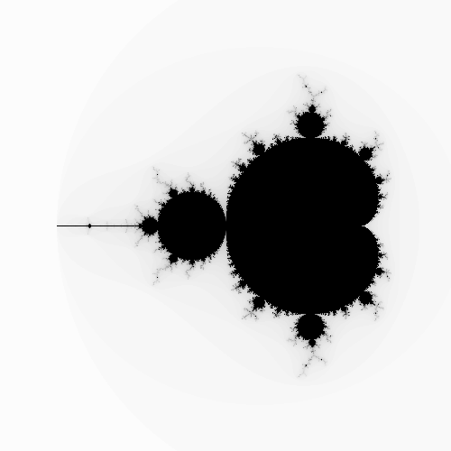

# rust-mandelbrot

A command line utility to generate visualizations of the [Mandelbrot Set](https://en.wikipedia.org/wiki/Mandelbrot_set).

## Example

```shell
.\rust-mandelbrot --x-res=500 --y-res=500 --zoom=150 --real-offset=-0.75  --output example.png
```



## Usage

```
rust-mandelbrot.exe [OPTIONS]

  -z, --zoom <ZOOM>
          Zoom factor (pixels per unit distance on complex plane) [default: 250]
  -t, --threshold <THRESHOLD>
          Threshold past width the sequence is assumed to diverge [default: 2]
  -m, --max-iterations <MAX_ITERATIONS>
          Number of iterations before assuming sequence does not diverge [default: 100]
  -w, --workers <WORKERS>
          Number of worker threads to run the calculation on [default: 1]
  -h, --help
          Print help
  -V, --version
          Print version
```
